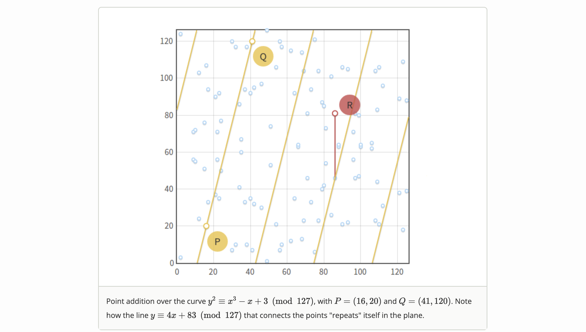

# Chapter 2: Abstract Algebra & Elliptic Curves

Before we could jump into the study for the proof system, we must first review some abstract algebra concepts and their applications in cryptography. The field of abstract algebra is way to big to realistically go through in this writing. I'll focus on writing down the concepts that's most related to ZKPs in the style of a handbook for the ease of review.

## Magmas, Semigroups, Monoids

- A magma is a set with a closed binary operator
- A semigroup is a magma where the binary operator is associative
- A monoid is a semigroup with an identity element

## Groups

#### Definition

a group is a set with

- an associative and closed binary operator (think about "+". Also called a closure G x G -> G)
- an identity element (think about 0)
- every element having an inverse (think about -a vs. a)
- (optional) the operator is also commutative (if so, it's called an abelian group)

#### Notable Examples of Groups

- Real numbers under addition is an abelian group
  - identity: 0
  - inverse of a: -a. Note that the inverse operation does not have to be computable by group laws, meaning we don't
      need to use the binary operator to compute it. The only thing matters is that an inverse exists for every element.
- Real numbers under multiplication is not a group because we cannot invert 0
- Addition modulo prime is an abelian group
  - identity: 0
  - inverse of a: the additive inverse of a mod p is just some x such that a + x = 0 mod p, or simply p - a

#### Subgroups

Let $G be a group, and $H$ a subset of $G$. Then $H$ is a _subgroup_ of $G$ if $H$ is itself a group using the same
operation as $G$.

- G is a subgroup of G
- {e} where e is the identity element, is a trivial subgroup of G
- The set of all powers of an element $g$ is a subgroup of G. This is called the cyclic subgroup generated by $g$.

### Finite Groups

#### Definition

Groups with finite number of elements.

#### Cayley Table

The following Cayley table represents the group of integers mod 5 under addition

|       | **0** | **1** | **2** | **3** | **4** |
| ----- | ----- | ----- | ----- | ----- | ----- |
| **0** | 0     | 1     | 2     | 3     | 4     |
| **1** | 1     | 2     | 3     | 4     | 0     |
| **2** | 2     | 3     | 4     | 0     | 1     |
| **3** | 3     | 4     | 0     | 1     | 2     |
| **4** | 4     | 0     | 1     | 2     | 3     |

The table cannot have duplicated elements in any row or column because if it does, then it's not a group anymore by
either not having an associative operator or not having an inverse for every element.

##### Proof by contradiction

Suppose that we have duplicates in its Cayley table, it means we have a + b = a + c somewhere in the table where b != c.
Suppose the associativity law and inverse law holds, we have
-a + a + b = -a + a + c
which reduces to b = c (contradicts b != c)

#### Group Order

The number of elements in the group, notated as $|G|$

#### Cyclic Groups

A cyclic group is a group that has an element such that every element in the group can be generated by repeatedly
applying the binary operator to it, or to its inverse.

##### Cyclic Groups are also Abelian

Proof
$R = {g + g + g + g + \ldots}$
$R = {m \cdot g + n \cdot g}$ for some arbitrary m and n. In order words, we group the list of $g$ into two groups.
Let $P = m \cdot g,\ Q = n \cdot g$
We have $R = P + Q$
We can also group the additions of $g$ differently:
$R = n \cdot g + m \cdot g$
Now we have $R = Q + P$, which demonstrates the commutative property of the binary operator, making the group an Abelian
group

### Group Homomorphism

Group A (with operator $\circ$) is homomorphic to group B (with operator $\square$) if there exists a transformation
$\phi : A \rightarrow B\ s.t.\ \forall a, a' \in A\ (\phi (a \circ a') = \phi (a)\ \Box\ \phi (a'))$

#### Examples of Group Homomorphism

- The group of all integers under addition to the group of integers mod 5 under addition
  $\phi$ is just the modulo function. The equality is `(a + a') % 5 = (a % 5 + a' % 5) % 5`
- The group of integers under addition and the group of powers of 2 under multiplication In this case, $\phi(x) = 2^x$.
  The equality is $2^{a + b} = 2^a * 2^b$.

#### Image

The image of a homomorphism $\rho : G \rightarrow H$ is the set $\{\rho (g) | g \in G\} \subset H$. Written as $\rho (
G)$.

#### Kernel

The kernel of $\rho$ is the set $\{g | g \in G, \rho (g) = 1\}$, written as $\rho^{-1}(1)$ where 1 is the identity
element of $H$.
In other words, all elements in $G$ that turn into the identity element in $H$ after applying the homomorphism.

#### The Product of Two Groups is a Group

$G \times G' \rightarrow G''$

#### Cosets

Let $H$ be a subgroup of $G$, and $H=\{h_1,h_2,h_3,…\}$. Then for any choice of $g \in G$, the coset $gH$is the set
$\{gh_1, gh_2, gh_3,...\}$

- Suppose that $H$ is a subgroup of $G$. Let $x, y \in G$. Then either $xH = yH$ or $xH$ and $yH$ have no elements in
  common.

#### Lagrange's Theorem

Let $H$ be a subgroup of a finite group $G$, then $|H|$ divides $|G|$

let $h = |G| / |H|$, then $h$ is the cofactor of $H$

## Rings

### Definition

A ring is a set with two binary operators such that

- under the first binary operator, the set is an abelian group
- under the second binary operator, the set is a monoid
- the second binary operator distributes over the first

### Examples of Rings

- The trivial ring {0} under addition and multiplication
- The set of all polynomials under addition and multiplication
  - The identity is $\{0x^0\}$ for addition and $\{1x^0\}$ for multiplication
  - The inverse under multiplication doesn't exist for a polynomial. We can't invert $x^2$ to get $x^{-2}$ because it
      is not a polynomial
- Square matrices of real numbers under addition and multiplication
  - The multiplicative identity is just the identity matrix I
  - Multiplicative inverse doesn't always exist because the determinent doesn't always = 0

## Fields

### Definition

A field is a set with two binary operators such that

- under the first binary operator, the set is an abelian group (think about "+")
- under the second binary operator, _excluding the zero element_, the set is an abelian group (think about "x" but with
  no 0)
- the second binary operator distributes over the first one

(Interpretation: a field is a ring where elements have inverses under the second operator)

### Examples of Fields

- There is no trivial fields because we need two identity elements.
- The set $\{0, 1\}$ is a field under addition and multiplication mod 2. This is also the smallest field.
- Integers under addition and multiplication is NOT a field (think about 1/4 as an inverse of 4) (but it's actually a
  ring)
- Real numbers (or rational numbers) under addition and multiplication is a field (it solves the issue of inverse above)
- Integers mod prime under addition and multiplication is a field. (every element except 0 has a multiplicative inverse
  because mod prime. Think about fermat's little theorem $a^p = a \rightarrow a^{p-2} = a^{-1}$)

## Elliptic Curves

### Definition

The set of points described by the equation $y^2 = x^3 + ax + b$ where $4a^3 + 27b^2 \neq 0$ (to exclude singularity).
This equation is called Weierstrass normal form for elliptic curves.

### Set Theoretic Definition

The set of points on an elliptic curve form an abelian group under elliptic curve point addition.

- The Identity Element is a "made up" point called "point at infinity". It is not even on the curve. The group that
  represents the EC just contains that point at infinity.
- the **inverse** of a point 𝑃 is the one symmetric about the x-axis
- **addition** is given by the following rule:given three aligned, non-zero points $P$, $Q$ and $R$, their sum is $P +
  Q + R = 0$ or $P + Q = -R$

### Geometric Addition

Because we are in an abelian group, $P + Q + R = 0$ can be written as $P + Q = -R$.

1. Draw a line that goes through $P$ and $Q$
2. Find the intersection of this line with the curve ($R$)
3. Find the inverse of R by flipping the sign of its $y$ value

What if:

- $P = O$ (or $Q = O$) where $O$ is the point at infinity: because $O$ is the identity element, $P + Q = Q$
- $P = -Q$: $Q$ is an inverse of $P$, the line is vertical. This means $P + Q = O$.
- $P = Q$: There are infinitely many lines can pass through point $P$. We take the tangent line only.
- $R = P$ (or $R = Q$): If the third point $R$ overlaps with $P$. $P + Q = -P$

#### Algebraic Addition

First, determine the slope of the line defined by $P$ and $Q$:

- if $P \neq Q, m = \frac{x_P - x_Q}{y_P - y_Q}$
  - Since we define the line that pass through $P$ and $Q$ when $P = Q$ as a tangent to the elliptic curve, we can
      take the first derivative of the curve to get its slope:
- if $P = Q, m = \frac{3x_{P}^2 + a}{2y_P}$, which is the first derivative of $y_P = \pm \sqrt{x_{P}^{3} + ax_P + b}$

Then, compute the $(x, y)$ for point R

- $x_R = m^2 - x_P - x_Q$
- $y_R = y_P + m(x_R - x_P)$ or
- $y_R = y_Q + m(x_r - x_Q)$

Since addition is defined as $P + Q = -R$, and since inverse is defined as "flipping the y", we have $(x_P, y_P) + (x_Q,
y_Q) = (x_R, -y_R)$

### Scalar Multiplication

Multiplying a scalar to a curve point: $nP = P + P + ... + P$ (n times)
Nothing more than regular point addition.

#### Double and Add

A special algorithm that turns scalar multiplication from the naive O(n) complexity to O(log n)
For $n = 5$ , the binary representation is 101
So $nP = 1 \cdot 2^2 P + 0 \cdot 2^0 + 1 \cdot 2^0 P$
We keep an accumulator of $P$ and double it each time. Each time we also decide if we add this "doubled" accumulator
to our running sum.
> Also called a "exponentiate by squaring" if we write the binary operator as "multiply" instead of "add".
>

## Elliptic Curves over Finite Fields

Elliptic curves over real numbers
$\{(x,y)\in \mathbb{R} | y^2=x^3+ax+b, 4a^3+27b^2\neq0\}$
Elliptic curves over finite fields
$\{(x,y)\in (\mathbb{F}_p)^2 | y^2=x^3+ax+b \mod p, 4a^3+27b^2\neq O \mod p\}$

> The set of curve points over $\mathbb{F}_p$ still form an abelian group. (No time to dig down into the proofs)

### Geometric Addition (GF)

Line equation for point addition
$ax + by + c \equiv 0 \mod p$

- Take the line through $P$ and $Q$, and "wrap" around (because finite field) when it reaches edge.
- Find the elliptic curve point $R$ that lands on the line. (this must happen because addition is closed)
- Find the inverse of the point $R$

#### Algebraic Addition (GF)

Exactly the same as the algebraic addition of curve points over real numbers except that every operation follows a mod.

#### Determining The Group Order

Schoof's algorithm. Too complicated, no time to dig down. The algorithm runs in polynomial time.

### Cyclic Subgroups of Elliptic Curve Groups

THe order of the cyclic subgroup is the smallest positive integer $n$ such that $nP = 0$.

> By Lagrange Theorem, this order also divides the order of the base group.

#### Method of Finding a Generator

Let $N$ be the order of the base group $B$ (can be determined using Schoof's algorithm)

Let $n$ be the order of the subgroup $H$ that we want (a divisor of the base group order, must be prime)

Note that $NP = 0$ for any point $P$ on the curve (fermat's little theorem)

The cofactor of the subgroup H is $h = N/n$

We have $n(hP) = 0$, this means that any $G \neq 0$ where $G = hP$ can be used as a generator of our subgroup because
$nG = 0$

So the process for finding a generator of prime subgroup is just

1. Choose a random point on the curve $P$ and compute $G = hP$
2. If $G = 0$, start over again. Otherwise, $G$ is the generator we want.

### The Discrete Logarithm Problem (DLP)

If we know $P$ and $Q$, what is $k$ such that $Q = kP$? This is believe to be a hard problem, but there is no proof.

This hardness enables us to "encrypt" a scalar $k$ into a curve point while still be able to perform valid math over
that scalar.

### The Domain Parameters of an Elliptic Curve

The domain is a sextuple $\{p, a, b, G, n, h\}$

- The prime $p$ that specifies the size of the finite field.
- The coefficients $a$ and $b$ of the elliptic curve equation.
- The base point $G$ that generates our subgroup.
- The order $n$ of the subgroup.
- The cofactor $h$ of the subgroup.

### Random Curves

Discrete logarithm is not hard for some curves. For example, all curves that have $p = hn$ (GF's order == EC's order)
are vulnerable to Smart's attack.

Given a curve, the user of the curve cannot know if the inventor has a "backdoor" fast algorithm for Dlog.

#### Seed

Seed $S$ is an additional domain parameter that generates the curve param $a$ and $b$. This makes the curve verifiably
random.

$S = random() \rightarrow H = hash(S) \rightarrow a = f(H), b = g(H)$

$hash$ is a trapdoor function.

Interpretation: $S$ can be a set value for a well-known curve, and we never need to change it. The only thing the user
need to do is check if the seed generates the correct $a$ and $b$ specified in the domain params of this curve. Then the
user knows $a$ and $b$ are not hand-picked.

## EC Pairing (Bilinear mapping)

Informal definition: A pairing is a bilinear map $e: G_1 \times G_2 \rightarrow G_T$ that satisfies:

- $e(r \cdot m, n) = e(m, r \cdot n) = r \cdot e(m, n)$
- $e(m_1 + m_2, n) = e(m_1, n) + e(m_2, n)$
- $e(m, n_1 + n_2) = e(m, n_1) + e(m, n_2)$

In the context of EC, pairing adds the "point multiplication" capability.
