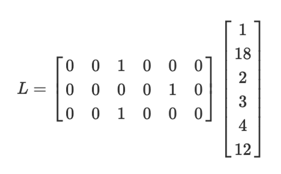
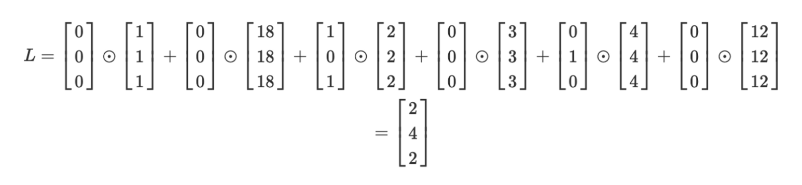

# Chapter 6: Groth 16 - Backend

## Quadratic Arithmetic Program (QAP)

QAP is a system of equations where the coefficients are monovariate polynomials and a valid solution results in a single polynomial equality. They are quadratic because they have exactly one polynomial multiplication. QAPs can be represented in R1CS.

- Operations in R1CS (addition and Hadamard product over column vectors) form a ring.
  - addition: element-wise addition
  - additive identity: all zero
  - additive inverse: flip sign for each element
  - multiplication: Hadamard product
  - multiplicative identity: all 1
  - multiplicative inverse: no
- Polynomials under addition and multiplication are rings.
  - addition: polynomial addition
  - additive identity: const poly $P(x) = 0$
  - additive inverse: flip sign for each coefficient
  - multiplication: polynomial multiplication
  - multiplicative identity: const poly $P(x) = 1$
  - no multiplicative inverse
- There exists homomorphism from vectors of dimension n with real number elements to polynomials with real coefficients.
  - Theorem: Given n points on a cartesian plane, they can be uniquely interpolated by a polynomial of degree $n - 1$.
  - Most commonly done by FFT.

### Homomorphism from Vectors of Dimension $n$ to Polynomials

The $\phi : V \rightarrow P$ function does the following:

- Treat vector elements as "y values"
- Assign each vector element an x value $x_1, x_2,...x_n$
- Interpolate the points to get a polynomial

No proof for the homomorphism, but the function $\phi$ is demonstrated in [r1cs.ipynb](../experiments/groth16.ipynb)

### Reducing Matrix Operations in $L \cdot s \odot R \cdot s = O \cdot s$ to Polynomial Operations

Original form

Scalars can be expressed as a column vector of all the same values

Now because the aforementioned ring homomorphism exists, if we perform polynomial interpolation on the column vectors, we can compute the same $L \cdot s \odot R \cdot s = O \cdot s$ in its polynomial form.

$U(x) = \langle transform(L), s \rangle$

$V(x) = \langle transform(R), s \rangle$

$W(x) = \langle transform(O), s \rangle$.

If $UV = W$, then $L \cdot s \odot R \cdot s = O \cdot s$.

Expanding the transform function

$\phi(L) = U = [u_1(x), u_2(x), ..., u_n(x)], L \in \mathbb{F}_{p}^{m \times n}$

$\phi(R) = V = [v_1(x), v_2(x), ..., v_n(x)], R \in \mathbb{F}_{p}^{m \times n}$

$\phi(O) = W = [w_1(x), w_2(x), ..., w_n(x)], O \in \mathbb{F}_{p}^{m \times n}$

$\phi(s) = a = (a_1, a_2, ..., a_n), a \in \mathbb{F}_{p}, a_1 = 1$

Basically, interpolating each column vector into a polynomial. Note that the transformation on $s$ is interpolating each element into a polynomial which is trivial.

## QAP in Polynomial Form

### Imbalanced form

$(U \cdot a)(V \cdot a) = W \cdot a$, the LHS has higher degree than the RHS.

### Balanced form

We can rewrite the original statement $L \cdot s \odot R \cdot s = O \cdot s$ to $L \cdot s \odot R \cdot s = O \cdot s + 0$ where $0$ is the zero matrix.

If we "interpolate" the zero matrix, we get a polynomial that vanishes everywhere in the domain. We can write this polynomial as $h(x)t(x)$ where $t(x)$ is the vanishing polynomial for the domain.

To compute $h(x)$,

$(U \cdot a)(V \cdot a) - (W \cdot a) = h(x) \cdot t(x)$

$h(x) = \frac{(U \cdot a)(V \cdot a) - (W \cdot a)}{t(x)}$ (Note: h(x) is a polynomial iff the numerator evaluates to 0 for the entire domain)

The equality is equivalently

$\sum_{i=0}^{n}{a_iu_i} \cdot \sum_{i=0}^{n}{a_iv_i} = \sum_{i=0}^{n}{a_iw_i} + h(x)t(x)$

### Reducing the Original Statement to Polynomial Identity Testing

The verifier randomly sample one point on the polynomial on both side of the equation $\sum_{i=0}^{n}{a_iu_i} \cdot \sum_{i=0}^{n}{a_iv_i} = \sum_{i=0}^{n}{a_iw_i} + h(x)t(x)$, if the evaluations are the same, then the probability that the original statement $L \cdot s \odot R \cdot s = O \cdot s$ is true is $d/|S|$ where $S$ is the domain (the aforementioned 1,2,...,n) and $d$ is the degree bound of both sides.

- The evaluation domain is directly determined by the group order of the curve we use, so it's normally extremely large.
- Degree bound $d$ is decided by the height $n$ of the orignal R1CS matrices (polynomials with degree bound n - 1 interpolate the column vectors).

### Trusted Setup

An external party (or parties) computes several series of points on both group 1 and 2 where the value of $\tau$ is uniformly random and is secret to both the prover and the verifier.

- $\tau G_1, \tau^2G_1, ..., \tau^nG_1$
- $\tau G_2, \tau^2G_2, ..., \tau^nG_2$

We want to prevent the prover from inventing the term $h(x)t(x)$ and to enforce that they must compute $h(x)$ from the correct equation. Because how $t(x)$ is a polynomial that is fixed when the degree (the height of the R1CS) is known, we can just compute its evaluation at $\tau$ in the trusted setup phase.

- $\tau t(\tau) G_1, \tau^2 t(\tau) G_1, ..., \tau^n t(\tau) G_1$

> It may seem that the above points are all zero points because $t(x)$ is supposed to evaluate to zero anywhere within the domain $\{x | 1 \leq x \leq d\}$. But in practice its eval is almost never zero because $\tau$ is randomly picked from an absurdly large field

The prover then computes the evaluations $(U \cdot a)(\tau)$, $(V \cdot a)(\tau)$, and $(W \cdot a)(\tau) + h(\tau)t(\tau)$ by multiplying $\tau^{i}G$ with the corresponding polynomial coefficient. The result is just three EC points.

$[A]_1 = (U \cdot a)(\tau) = u_d(\tau^d G_1) + u_{d-1}(\tau^{d-1} G_1) +,...,+ u_0(G_1)$

$[B]_2 = (V \cdot a)(\tau) = v_d(\tau^d G_2) + v_{d-1}(\tau^{d-1} G_2) +,...,+ v_0(G_2)$

$[C]_1 = (W \cdot a)(\tau) = w_d(\tau^d G_1) + w_{d-1}(\tau^{w-1} G_1) +,...,+ w_0(G_1) + h(\tau G_1)t(\tau G_1)$

where [$h(\tau G_1)t(\tau G_1)]_1 = \langle h_1, h_2, ... h_n \rangle \cdot \langle \tau t(\tau) G_1, \tau^2 t(\tau) G_1, ..., \tau^n t(\tau) G_1 \rangle = \sum_{i = 1}^{n}{h_i\tau^it(\tau)G_1}$

The verifier checks $e([A]_1, [B]_2) = e([C]_1, G_2)$

This allows the prover to "simulate" sampling the polynomials at a random point they don't know, and is what makes GROTH "non-interactive".

## GROTH16

### Secret Shifting with $\alpha$ and $\beta$

Checking just $e([A]_1, [B]_2) = e([C]_1, G_2)$ in the above setting isn't meaningful. The prover can just invent the points

- $[A]_1 = aG_1$
- $[B]_2 = bG_2$
- $[C]_1 = cG_1$

where a * b = c, and send them to the verifier, the verifier can't be sure of anything.

> We need a way to introduce common reference to the protocol so that the verifier can know that the prover cannot compute C by inventing A and B, and vice versa.

Shifting A and B by $\alpha$ and $\beta$

$[A]_1 = [A_{old}]_1 + \alpha$

$[B]_1 = [B_{old}]_1 + \beta$

$\sum_{i=0}^{n}{a_iu_i(x)} \sum_{i=0}^{n}{a_iv_i(x)} = \sum_{i=0}^{n}{a_iw_i(x)} + h(x)t(x)$

$= (\alpha + \sum_{i=0}^{n}{a_iu_i(x)})(\beta + \sum_{i=0}^{n}{a_iv_i(x)})$

$= \alpha \beta + \beta \sum_{i=0}^{n}{a_iv_i(x)} + \sum_{i=0}^{n}{a_iu_i(x)} + \sum_{i=0}^{n}{a_iu_i(x)} \sum_{i=0}^{n}{a_iv_i(x)}$

$= \alpha \beta + \beta \sum_{i=0}^{n}{a_iv_i(x)} + \sum_{i=0}^{n}{a_iu_i(x)} + \sum_{i=0}^{n}{a_iw_i(x)} + h(x)t(x)$

$(\alpha + \sum_{i=0}^{n}{a_iu_i(x)})(\beta + \sum_{i=0}^{n}{a_iv_i(x)}) = \alpha \beta + \sum_{i=0}^{n} a_i(\beta u_i(x) + \alpha v_i(x) + w_i(x)) + h(x)t(x)$

### Splitting Public and Private Inputs with $\gamma$ and $\delta$

$\sum_{i=0}^{n}{a_i w_i(x)} = \gamma^{-1} \sum_{i=0}^{l}{a_i w_i(x)} + \delta^{-1} \sum_{i=l+1}^{n}{a_i w_i(x)}$

$\sum_{i=0}^{n} a_i(\beta u_i(x) + \alpha v_i(x) + w_i(x)) + h(x)t(x)$ Splits into

- public part: $\sum_{i=0}^{l} a_i \gamma^{-1}(\beta u_i(x) + \alpha v_i(x) + w_i(x)) + \gamma^{-1}h(x)t(x)$
- private part: $\sum_{i=l+1}^{n} a_i \delta^{-1}(\beta u_i(x) + \alpha v_i(x) + w_i(x)) + \delta^{-1}h(x)t(x)$

> By introducing $\gamma$ and $\delta$ we enforce a rigid structure in terms of which part of the witness is public and which is private.

### Zero Knowledge with $r$ and $s$

Even though we encrypt everything in EC points, if the preimage space is small, an attacker can still guess the preimage by exhaustive checking. e.g. making voting (two possible values yes/no) zero knowledge. Introducing yet another shifting can solve this problem.

The idea is to introducing some prover-known-only value into the computation the points A, B, and C in a way that does not disturb the balance of the equation.

$[A]_1 = [\alpha]_1 + \sum_{i=0}^{n}{a_i u_i(\tau G_1)} + r[\delta]_1$

$[B]_2 = [\beta]_2 + \sum_{i=0}^{n}{a_i v_i(\tau G_2)} + s[\delta]_2$

$[B]_1 = [\beta]_1 + \sum_{i=0}^{n}{a_i v_i(\tau G_1)} + s[\delta]_1$

Note that there is an additional intermediate $[B]_1$ point we compute but in group 1 instead group 2

$[C]_1 = \sum_{i=0}^{n}{a_i [\beta u_i(\tau G_1) + \alpha v_i(\tau G_1) + w_i(\tau G_1)]_1} + s[A]_1 + r[B]_1 - rs[\delta]_1$

> $r$ and $s$ is sampled by the prover not in the trusted setup phase because the veifier is the only one who shouldn't know the values.

### Computing the New $[C]_1$

$[C]_1 = \sum_{i=l+1}^{n} a_i \delta^{-1}(\beta u_i(x) + \alpha v_i(x) + w_i(x)) + \delta^{-1} h(x)t(x)$

Note that the summation starts from $i = l + 1$. So this is only the private part of $C$

Notice that now the computation of $[C]_1$ requires point multiplication involving $\alpha$ and $\beta$. Normally this can only be done through pairing, which is expensive.

As a workaround, we can compute the evaluation of the term $\delta^{-1} (\beta u_i(x) + \alpha v_i(x) + w_i(x))$ at $\tau$ during the trusted setup phase.

It might look like the trusted setup outputs the evaluation of $\delta^{-1} (\beta u_i(\tau G_1) + \alpha v_i(\tau G_1) + w_i(\tau G_1))$ is just a single point, but actually the setup outputs the powers of tau for

- $\delta^{-1} \beta u_i(\tau G_1) = \{\delta^{-1} \beta \tau^j u_{i,j}G_1\}_{j=0}^{m-1}$
- $\delta^{-1} \alpha v_i(\tau G_1) = \{\delta^{-1} \alpha \tau^j v_{i,j}G_1\}_{j=0}^{m-1}$
- $\delta^{-1} w_i(\tau G_1) = \{\delta^{-1} \tau^j w_{i,j}G_1\}_{j=0}^{m-1}$

> Note that $\delta^{-1}$ goes into the part which is computed during the setup phase instead of letting the prover supply it along with $a_i$. This ensures that the prover must supply the witness vector of the correct length to their $C$ computation.

> The above fomulae means the trusted setup phase needs to compute 3(m-1) * n additional points where m is the degree of the individual polynomials (the height of the R1CS - 1) and n is the number of columns in the R1CS.

### Trusted Setup Steps

#### Compute powers of tau for $A$

$\{\tau^i G_1\}_{i=0}^{m-1}$

#### Random shift for A

Sample random $\alpha$ from the field, then compute $\alpha G_1$

#### Compute powres of tau for $B$

$\{\tau^i G_2\}_{i=0}^{m-1}$

#### Random shift for B

Sample random $\beta$ from the field, then compute $\beta G_2$

#### Compute powers of tau for C

- for public inputs: $\{\gamma^{-1} (\beta u_i(\tau) + \alpha v_i(\tau) + w_i(\tau))G_1\}_{i=0}^{l}$
- for private inputs: $\{\delta^{-1} (\beta u_i(\tau) + \alpha v_i(\tau) + w_i(\tau))G_1\}_{i=l+1}^{m-1}$

#### Compute powers of tau for $h(x)t(x)$

- evaluate $t(\tau)$
- $\{\delta^{-1} \tau^i t(\tau)G_1\}_{i=0}^{m-1}$

#### Compute the public/private split

sample random $\gamma$ and $\delta$ from the field, then compute $\gamma G_1$ and $\delta G_1$

### Prover Steps

#### Compute A and B

$[A]_1 = \alpha + \sum_{i=0}^{n}{a_i u_i(\tau G_1)} + r\delta$

$[B]_2 = \beta + \sum_{i=0}^{n}{a_i v_i(\tau G_2)} + s\delta$

#### Compute $h(x)$, then C

$h(x) = \frac{\sum_{i=0}^{n}{a_i u_i(x)}\sum_{i=0}^{n}{a_i v_i(x)}}{t(x)}$

$[h(\tau)t(\tau)]_1 = \sum_{i=0}^{deg(h)}{h_i \tau^i t(\tau G_1)}$

$[C]_1 = \sum_{i=l+1}^{n}{a_i \delta^{-1}(\beta u_i(\tau G_1) + \alpha v_i(\tau G_1) + w_i(\tau G_1))} + s[A]_1 + r[B]_1 - rs[\delta]_1$

$proof = ([A]_1, [B]_2, [C]_1)$

#### Verifier Steps

$[Pub]_1 = \sum_{i=0}^{l}{a_i\gamma^{-1}[\beta u_i(\tau G_1)} + \alpha v_i(\tau G_1) + w_i(\tau G_1)]_1$

$e([A]_1, [B]_2) = e([\alpha]_1, [\beta]_2) + e([Pub]_1, [\gamma]_2) + e([C]_1, [\delta]_2)$

And accepts if the equality is true.

### Reference Strings

Reference strings here omits the EC group and integer field related items.

Verifying key consists of:

- The set of terms that handles the public part of the wirness: $\{[\beta u_i(x) + \alpha v_i(x) + w_i(x)]_1\}_{0}^{l}$
- $[\gamma]_1$, $[\delta]_1$, $[\alpha \beta]_T$
